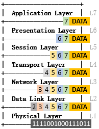

# 隨手記：網路教材
## OSI Model
### Overview
 

### Encapsulation
OSI 每層的資料封裝都有定義名稱：
- L1-PDU：位元 (Bit)
- L2-PDU：訊框 (Frame)
- L3-PDU：封包 (Packet)
- L4-PDU：區段 (Segment)
- L5-PDU：資料 (Data)
- L6-PDU：資料 (Data)
- L7-PDU：資料 (Data)

有時概稱為封包 (Packet)。
